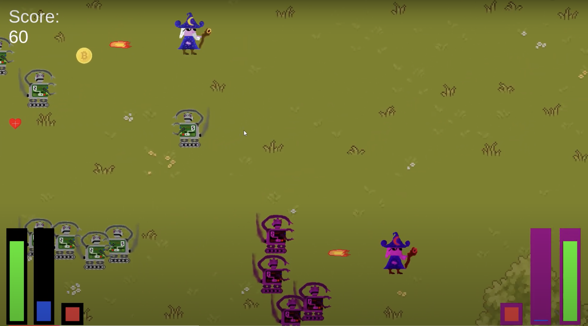

 

# Wizards vs. Robots

A 2D co-op wave survival game. Have a look at the [video demo](https://youtu.be/7E_7Vb-jXSk)!

This project was built in a group effort for software engineering class at DHBW Karlsruhe. 

